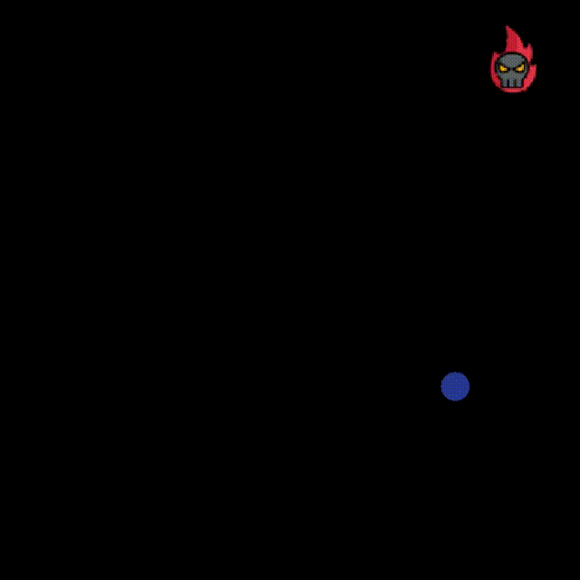

# Project Moon

this is an application in which the ball bounces in the middle of the edge. after each cycle, an obstacle is generated in a random place. in the event of an obstacle colliding with the ball, the possible direction of the ball's bounce is checked, and then the ball bounces in a random direction.

# Gif's

  
  
  
  

## You can download here:

https://github.com/dominikoka/application_moon
